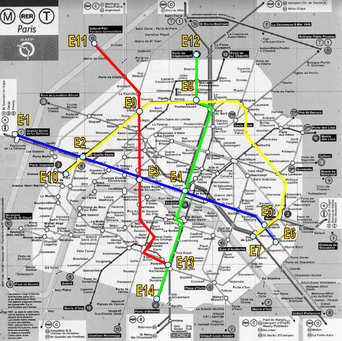

# Atividade sobre Busca Heurística A\*

## Cálculo de rotas - Problema do metrô de Paris

Queremos construir um sistema para auxiliar um usuário do metrô de Paris a saber
o trajeto mais rápido entre a estação onde ele se encontra e a estação de destino. O
usuário tem um painel com o mapa, podendo selecionar a sua estação de destino. O
sistema então acende as luzes sobre o mapa mostrando o melhor trajeto a seguir.
Para simplificar o problema, consideramos apenas 4 linhas do metrô.

### Considere que

- A distância em linha reta entre duas estações quaisquer é dada pela Tabela 1 e a
  distância real é dada pela Tabela 2.
- A velocidade média de um trem é de 25km/h;
- O tempo gasto para trocar de linha dentro de mesma estação (fazer baldeação) é
  considerado nulo (para facilitar).

## Dados do problema

### Tabela 1: Distâncias diretas entre as estações do Metrô

|     | E1  | E2  | E3  | E4   | E5   | E6   | E7   | E8   | E9   | E10  | E11  | E12  | E13   | E14  |
| --- | --- | --- | --- | ---- | ---- | ---- | ---- | ---- | ---- | ---- | ---- | ---- | ----- | ---- |
| E1  | -   | 10  | 18  | 24,8 | 36,4 | 38,8 | 35,8 | 25,4 | 17,6 | 9,1  | 16,7 | 27,3 | 27,6  | 29,8 |
| E2  |     | -   | 8,5 | 14,8 | 26,2 | 29,1 | 26,1 | 17,3 | 10   | 3,5  | 15,5 | 20,9 | 19,1  | 21,8 |
| E3  |     |     | -   | 6,3  | 18,2 | 20,6 | 17,6 | 13,6 | 9,4  | 10,3 | 19,5 | 19,1 | 12,1  | 16,6 |
| E4  |     |     |     | -    | 12   | 14,4 | 11,5 | 12,4 | 12,6 | 16,7 | 23,6 | 18,6 | 10,61 | 15,4 |
| E5  |     |     |     |      | -    | 3    | 2,4  | 19,4 | 23,3 | 28,2 | 34,2 | 24,8 | 14,5  | 17,9 |
| E6  |     |     |     |      |      | -    | 3,3  | 22,3 | 25,7 | 30,3 | 36,7 | 27,6 | 15,2  | 18,2 |
| E7  |     |     |     |      |      |      | -    | 20   | 23   | 27,3 | 34,2 | 25,7 | 12,4  | 15,6 |
| E8  |     |     |     |      |      |      |      | -    | 8,2  | 20,3 | 16,1 | 6,4  | 22,7  | 27,6 |
| E9  |     |     |     |      |      |      |      |      | -    | 13,5 | 11,2 | 10,9 | 21,2  | 26,6 |
| E10 |     |     |     |      |      |      |      |      |      | -    | 17,6 | 24,2 | 18,7  | 21,2 |
| E11 |     |     |     |      |      |      |      |      |      |      | -    | 14,2 | 31,5  | 35,5 |
| E12 |     |     |     |      |      |      |      |      |      |      |      | -    | 28,8  | 33,6 |
| E13 |     |     |     |      |      |      |      |      |      |      |      |      | -     | 5,1  |
| E14 |     |     |     |      |      |      |      |      |      |      |      |      |       | -    |

### Tabela 2: Distâncias e conexões reais entre as estações do Metrô

|     | E1  | E2  | E3  | E4  | E5  | E6  | E7  | E8   | E9  | E10 | E11  | E12 | E13  | E14 |
| --- | --- | --- | --- | --- | --- | --- | --- | ---- | --- | --- | ---- | --- | ---- | --- |
| E1  | -   | 10  |     |     |     |     |     |      |     |     |      |     |      |     |
| E2  |     | -   | 8,5 |     |     |     |     |      | 10  | 3,5 |      |     |      |     |
| E3  |     |     | -   | 6,3 |     |     |     |      | 9,4 |     |      |     | 18,7 |     |
| E4  |     |     |     | -   | 13  |     |     | 15,3 |     |     |      |     | 12,8 |     |
| E5  |     |     |     |     | -   | 3   | 2,4 | 30   |     |     |      |     |      |     |
| E6  |     |     |     |     |     | -   |     |      |     |     |      |     |      |     |
| E7  |     |     |     |     |     |     | -   |      |     |     |      |     |      |     |
| E8  |     |     |     |     |     |     |     | -    | 9,6 |     |      | 6,4 |      |     |
| E9  |     |     |     |     |     |     |     |      | -   |     | 12,2 |     |      |     |
| E10 |     |     |     |     |     |     |     |      |     | -   |      |     |      |     |
| E11 |     |     |     |     |     |     |     |      |     |     | -    |     |      |     |
| E12 |     |     |     |     |     |     |     |      |     |     |      | -   |      |     |
| E13 |     |     |     |     |     |     |     |      |     |     |      |     | -    | 5,1 |
| E14 |     |     |     |     |     |     |     |      |     |     |      |     |      | -   |

### Mapa do metrô de Paris



## Tecnologias utilizadas

Essa atividade foi desenvolvida com as seguintes tecnologias:

- JavaScript
- Node

## Instruções

- Certifique-se que você tem instalado na sua máquina o [node](https://nodejs.org/en).
- Faça um `git clone` no repositório.
- Pelo terminal navegue até a pasta do projeto utilizando `cd atividade-busca-heuristica-a`.
- Após isso execute o comando `node index.js` e os resultados serão visualizados na tela.

## Modificações

- Você pode alterar os valores da estação inicial e da estação destino, modificando as variáveis `estadoInicialNome` e `estadoFinalNome`.
- Você pode alterar os valores da Tabela 1 e Tabela 2, modificando a variável `distancias`.

## Output

- Para cada estado da busca será retornado o seguinte output:

```
Estado atual:  E5
Fronteira:  [
  { nome: 'E4', custo: 31.4 },
  { nome: 'E7', custo: 21 },
  { nome: 'E8', custo: 60.6 }
]
```

- Onde `Estado atual` é o estado atual da busca e `Fronteira` uma array de nós de fronteiras com seus respectivos custos.
- Uma vez encontrado o caminho será retornado o seguinte output:

```
ENCONTRADO!
Custo final:  33.9
Caminho completo:  [
  { name: 'E6', cost: 0 },
  { name: 'E5', cost: 3 },
  { name: 'E4', cost: 16 },
  { name: 'E13', cost: 28.8 },
  { name: 'E14', cost: 33.9 }
]
```

- Onde `Custo final` é o custo do trajeto completo e `Caminho completo` é um array de nós com seus pesos acumulativos.
